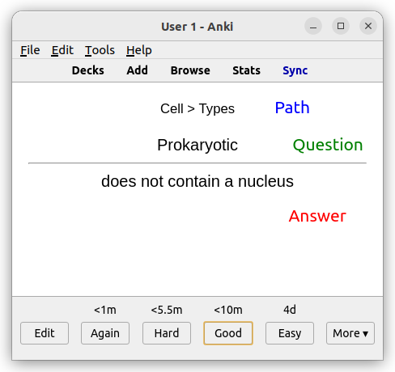

# Ankivalenz

Ankivalenz is a tool for generating Anki cards from HTML files. Read my [blog post](https://harry.vangberg.name/posts/anki-cards-with-ankivalenz/) for more information on the "Why" of Ankivalenz.

## Tutorial

In this walk-through we will write our notes as Markdown files, use
pandoc[^pandoc] to convert them to HTML, and finally use Ankivalenz to
generate an Anki deck with Anki cards extracted from our Markdown files.

### Installation

Ankivalenz is distributed as a Python package, and requires Python 3.10+. To install:

```
$ pip3 install ankivalenz
```

### Initialize project

Create a folder for your notes:

```
$ mkdir Notes
$ cd Notes
```

Ankivalenz needs a configuration file, containing the name and ID of the
Anki deck. This can be generated with `ankivalenz init`:

```
$ ankivalenz init .
```

### Write a note

Add the following to a file named `Cell.md`:

```markdown
# Cell

## Types

- Prokaryotic ?:: does not contain a nucleus
- Eukaryotic ?:: contains a nucleus
```

### Generate Anki deck

Convert it to HTML:

```
$ pandoc Cell.md > Cell.html
```

And run Ankivalenz:

```
$ ankivalenz run .
```

This generates a file `Notes.apkg` that can be imported to Anki. Open
Anki and go to File -> Import, and find `Notes.apkg`.

### Updating Anki deck

If you make changes to your notes, you can update the Anki deck by
running `ankivalenz run` again. It is not possible to mark cards
as deleted, so if you remove a note, the corresponding card will
remain in the Anki deck. To work around this issue, all cards are
tagged with a timestamp, and you can use the Anki browser to delete
cards with an old timestamp. Running `ankivalenz run` will provide
you with the filter needed to delete orphaned cards:

```
$ ankivalenz run .
- Added 3 notes to deck Biology in Biology.apkg
- Import the .apkg file into Anki (File -> Import)
- Find and delete orphaned notes with this filter (Browse):
    deck:Biology -tag:ankivalenz:updated:1666899823
```

### Review

The new Anki deck will have two cards:

| Question    | Answer                     | Path         |
| ----------- | -------------------------- | ------------ |
| Prokaryotic | does not contain a nucleus | Cell > Types |
| Eukaryotic  | contains a nucleus         | Cell > Types |

This is what the first note looks like in Anki:



## Syntax

### Front/back cards

Ankivalenz supports front/back cards, where the front is the question
and the back is the answer. To create a front/back card, add a new list item
with the question, followed by `?::` and the answer:

```markdown
- Color of the sun ?:: Yellow
```

You can flip the order of the question and answer by using `::?` instead:

```markdown
- Anwer ::? Question
```

#### Two-way cards

Two-way cards can be created with `::`:

```markdown
- Side 1 :: Side 2
```

This will create two cards in Anki:

| Front  | Back   |
| ------ | ------ |
| Side 1 | Side 2 |
| Side 2 | Side 1 |

#### Standalone questions/answers

Sometimes you want to create a note refering to the parent heading.
This can be done with standalone questions/answers:

```markdown
- Sun
  - ::? The star in our solar system
```

This will create a note with the answer "Sun" and the question "The star
in our solar system". The other types of delimeters ("::" and "?::") can
be used in the same way.

### Cloze cards

Ankivalenz supports cloze deletion[^cloze], where the answer is hidden in the
question. To create a cloze card, add a new list item with the question,
using Anki's cloze syntax:

```markdown
- The {{c1::sun}} is {{c2::yellow}}.
```

### Nested lists

Lists can be nested:

```markdown
- Solar System
  - Star ?:: Sun
  - Planet
    - Earth ?:: Blue
    - Mars ?:: Red
```

The headings for the nested lists become a part of the notes' paths:

| Question | Answer | Path                  |
| -------- | ------ | --------------------- |
| Star     | Sun    | Solar System          |
| Earth    | Blue   | Solar System > Planet |
| Mars     | Red    | Solar System > Planet |

### Math

If you are writing Markdown files, and use pandoc to convert them,
the following syntax for math is supported:

```markdown
- Inline math: $1 + 2$
- Display math: $$1 + 2$$
```

With the `--mathjax` flag, pandoc will generate the correct markup,
using `\( ... \)` as delimeters for inline math, and `\[ ... \]` as
delimeters for display math:

```
$ pandoc --mathjax Note.md > Note.html
```

[^pandoc]: https://pandoc.org/
[^cloze]: https://docs.ankiweb.net/editing.html#cloze-deletion

## Configuration

`ankivalenz.json` takes the following options:

| Option       | Description                                       |
| ------------ | ------------------------------------------------- |
| `deck_name`  | The name of the Anki deck.                        |
| `deck_id`    | The ID of the Anki deck.                          |
| `input_path` | The path to the folder containing the HTML files. |
