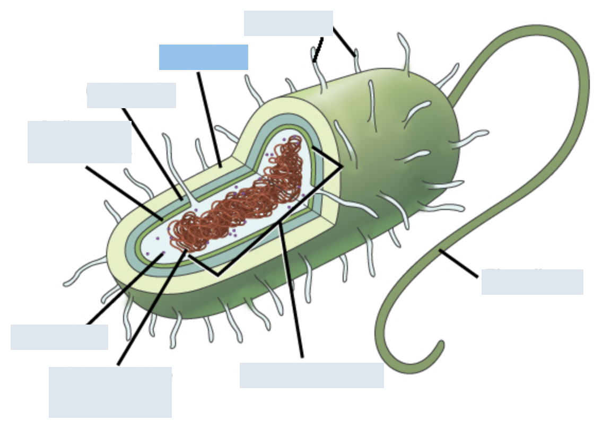

# Cell

## Types

-   Prokaryotic

    -   :: does **not** contain a nucleus
    -   Domains ?:: Eukarya

-   Eukaryotic

    -   :: contains a nucleus
    -   Domains ?:: Bacteria, Archaea

## Prokaryotic

-   Capsule

    -   ::?  
        {width="150"}

## Flagella

-   

    -   a ?:: Monotrichous

    -   b ?:: Lophotrichous

    -   c ?:: Amphitrichous

    -   d ?:: Peritrichous
