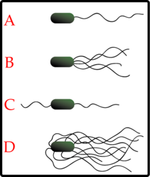

# Chemistry

## Bonds

-   Covalent bond :: electrons are shared

-   Ionic bond :: electrons are transferred

## Reaction

-   $A + B$ ?:: $\dfrac{C}{D}$
-   Math ?::  
      
    $$
    1 + 2 = \dfrac{3}{4}
    $$
